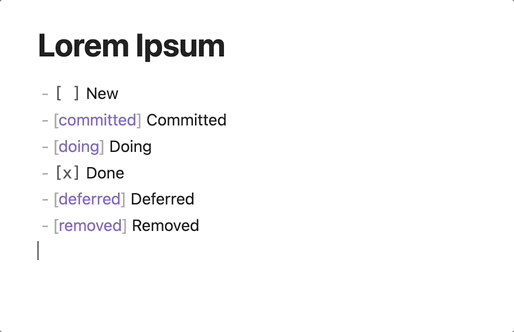
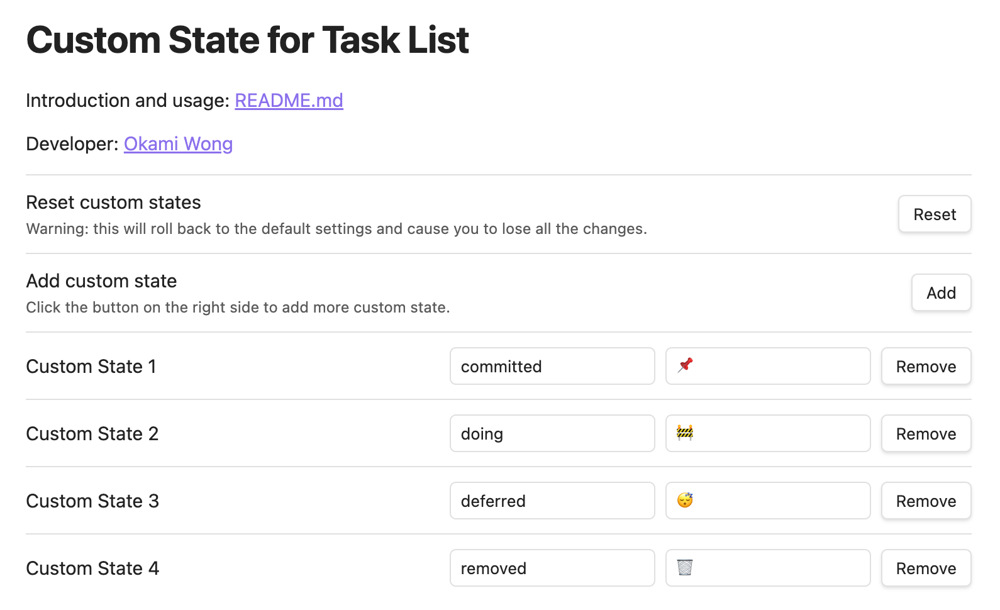

# Custom state for task list in Obsidian

A plugin for [Obsidian](https://obsidian.md) to help you define your own states for task list!

## How to install

Please refer to [Community plugins - Obsidian Help](https://help.obsidian.md/Extending+Obsidian/Community+plugins)

## How to use

- Simply put the name of your custom state inbetween the square brackets of a task item.
  - For example, if you want to mark the following task as `doing`
    - `- [ ] Some task`
  - Just put `doing` inside the square brackets like
    - `- [doing] Some task`
  - In the reading view of Obsidian, this task will be rendered as
    - `🚧 Some task`

- The default states are (`{stateName} ➡ {readingView}`)
	- `committed` ➡ 📌
    - You have decide to do this task some day
	- `doing` ➡ 🚧
    - You are currently working on this task
	- `deferred` ➡ 😴
    - The completion of this task is postponed 
	- `removed` ➡ 🗑
    - The task is removed
- You can edit the default states and add more states in the settings.

